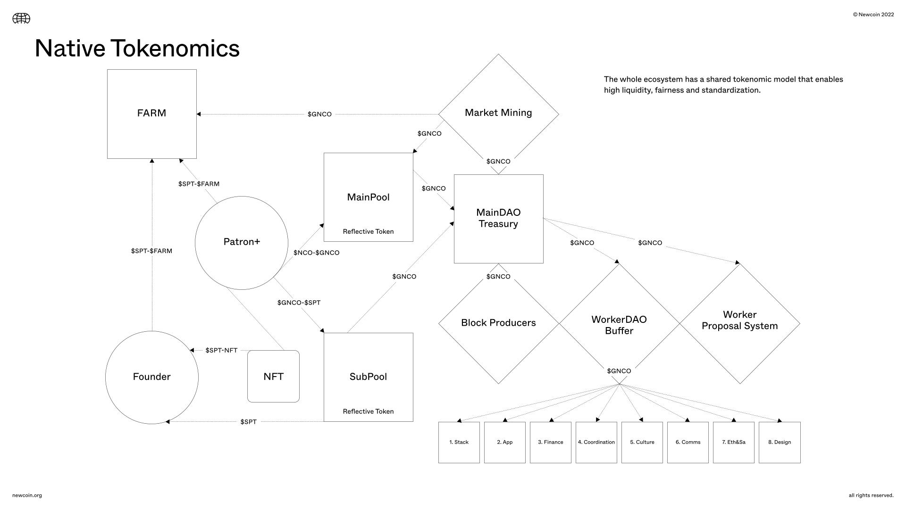

## Economic layer 
### Accounts
In order to create an account, the account issuer will have to pay $NCO for the RAM that will be made available to store the data related to the account. The amount will depend on the supply and demand for RAM and is calculated via the Bancor algorithm. The price per account created should average around 5$ and the cost can be supported by the App developer, the account issuer or the account holder.
### Collectives creation
Accounts can decide to create a "collective" account where all the income will be split according to a predetermined percentage, which can be very convenient for collaborative projects involving multiple creators. For example a fashion shooting involving a model, a designer, a stylist, and a photographer.

### Participation: staking pools
The investments are happening via pools. Pools can belong to the creator in the simpler case and be managed by the creator. The best equivalent in the regular economy is private proprietorship. 

### NFT tokens
The minting of NFTs will depend on the amount of RAM required based on the amount of metadata stored on-chain for each NFT and will range between $0.01 and up to $5 for the RAM intensive assets.

### Transaction fees
Each account has a quote of 8 free transactions per day which means absolutely no "gas fees" for transactions. Beyond the free per account quota, packages are provided upon staking.

### DAOs
One of the main advantages of the design-aware blockchain architecture is its ability to leverage its knowledge of app-level activity into the protocol governance.
Each SubDAO is moderated by its founder and members which provides a more secure, yet highly coordinated micro-entity (DAO) which can operate at human-scale with proper vetting and produce decentralized KYC mechanics.
Meanwhile the sum of all DAOs gets involved in broader, infrastructure-level, decisions such as voting for DAO workers, block producers, allocating system-wide grants or deploying new contracts.
This governance architecture can be therefore viewed as a DAO of DAOs where a cascade of governance decisions lead to a more scalable and decentralized network.

### Newmoon Grants
The [Newmoon Accelerator](https://www.newmoon.ac) provides grants for dApps on the Newprotocol, to support new dApps and developers with reduced fees. Apply Today or join their Discord!